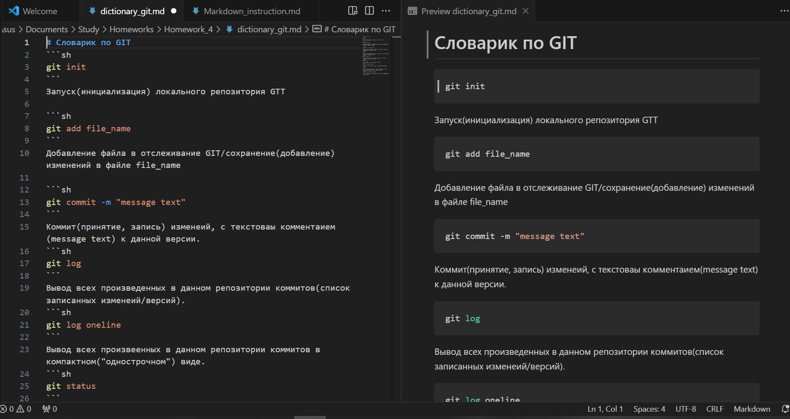

# Инструкция по работе с Markdown
## Выделение текста
Чтобы выделить текст курсивом, необходимо обрамить его смволами "звёздочка"(*) или знаком нижнего подчеркивания (_)

Например: *крусив*

Или: _курсив_

Чтобы выделить текст полужирным, необходимо обрамить его двойными смволами "звёздочка"(**) или двойным знаком нижнего подчеркивания (__)

Например: **полужирный**

Или так: __полужиный___

Альтернативные способы нужны для совмещения обоих методов выделения текста:

Например: __*Полужирный курсив*__
## Списки
Чтобы добавить ненумированный список, в начале сторки ставится симвой "звездочка" (*) или знгаком "плюс" (+)

Например:
* Пункт
* Следующий пункт
* Ещё один пункт
+ И ешё один

Чтобы добавить нумированный список, в начале сторки ставится номер пункта

Например:
1. Первый пункт
2. Второй пункт
3. Третий пункт
## Работа с изображением
Чтобы вставить изображение в текст, необходимо написать следующее: 
## Ссылки
Для добавлениия ссылки заключаем её в треугольные скобки:
Например: 
<https://zip.ru/>
## Работа с таблицами
Для форматирования текста в виде таблиц используется вериткальная черта ( | ) в качестве разделителя столбцов. При этом после строки с загорловками должна идти сторока отделитель из дефисов ( - ). Их количество может быть любым, это удобно для того чтоб текст кода был читабельным. Также добавляя  в сторку отделитьель двоеточие ( : ), можно задать форматирование.  
Пример таблицы:

| Первый столбец | Воторой ст.| Третий | Четвертый  | 
|:--------------:|-----------:|--------|:-----------|
|Много           |Меньше      |        |слева пусто |

## Цитаты
## Заключение